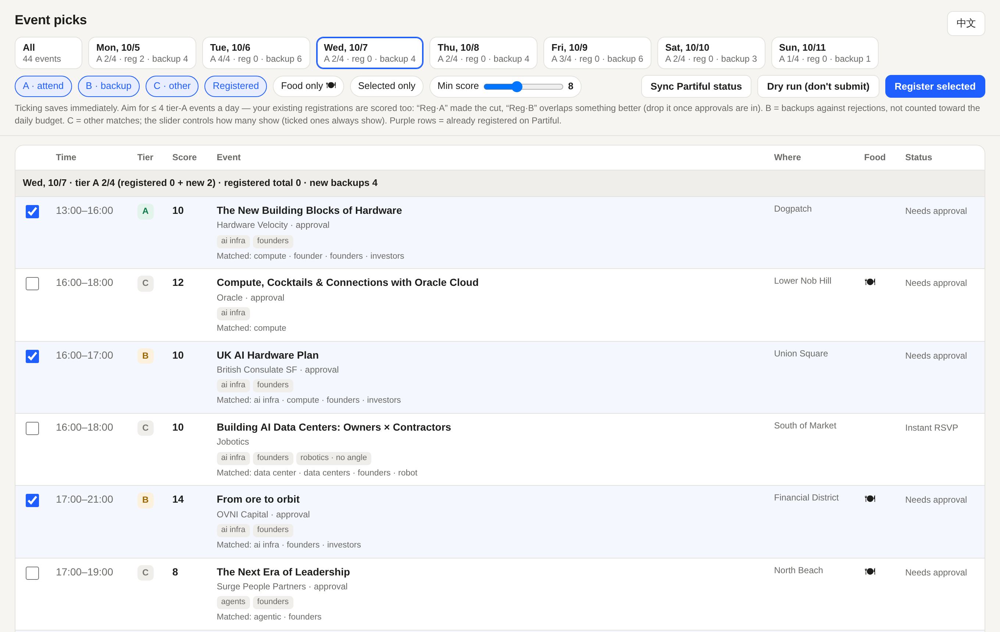

# EventsAutomation

**English** · [中文](README.zh-CN.md)

Tech weeks list over a thousand side events, and signing up for them by hand takes hours. This
tool does it for you:

1. **Finds** every event on the calendar (first source: [a16z Tech Week](https://www.tech-week.com): SF, NYC, LA, Boston).
2. **Ranks** them against *your* profile (topics, food, distance) and splits them into tiers you can actually attend.
3. **Lets you pick** in a local web page: tick boxes, nothing to read in files.
4. **Registers** you on Partiful, answering host questionnaires from your profile.
5. **Checks** each result against your Partiful account and tracks approvals, so confirmed events can go to your calendar.


<sub>Demo data: public SF Tech Week events ranked for a fictional AI-infra founder profile.</sub>

---

## Quick start

Requires Python 3.10+.

```bash
git clone <this repo> && cd EventsAutomation
pip install -r requirements.txt
playwright install chromium

mkdir SF_2026 && cp profile.example.yaml SF_2026/profile.yaml
# edit SF_2026/profile.yaml: your details, interests, answers to common questions
```

A **workspace** is one folder per event week (e.g. `SF_2026/`). It holds your `profile.yaml` and
everything the tool caches. Workspaces are git-ignored.

### 1 · Collect and rank (about an hour, unattended)

```bash
python -m eventsauto fetch   --ws SF_2026 --city sf   # whole calendar (~1,700 events)
python -m eventsauto links   --ws SF_2026             # resolve RSVP links for events matching your profile
python -m eventsauto details --ws SF_2026             # full descriptions + host questionnaires
python -m eventsauto rank    --ws SF_2026             # score and tier everything
```

`links` is deliberately slow (one request every ~7 s, the site's rate limit), and it only touches
events that match your profile. Every step caches its results and can be re-run safely.

### 2 · Sign in to Partiful once

```bash
python -m eventsauto login --ws SF_2026
```

A browser window opens. Sign in with your phone number and SMS code yourself; the tool never sees
them. The session is kept in `SF_2026/.browser-profile/`. Partiful's web sessions expire now and
then; when that happens, the login window pops up again automatically.

```bash
python -m eventsauto sync --ws SF_2026   # import events you already registered for by hand
```

### 3 · Pick in the browser

```bash
python -m eventsauto serve --ws SF_2026   # open http://localhost:8765
```

- Day cards show how many **tier-A** events you have per day against your `per_day` budget; over-budget days turn red.
- Tick or untick events; every change saves immediately.
- Each row shows the **matched keywords**, so you can see why it scored the way it did.
- **Dry run** fills every form and takes screenshots without submitting. Check `data/dryrun.json` or ask questions about anything flagged "Needs info".
- **Register selected** submits, skips anything already registered, and verifies each event against your account at the end.
- **Sync Partiful status** refreshes approvals.

The page is in English, or Chinese if your browser is set to Chinese. The button in the top-right switches languages.

### 4 · Calendar

```bash
python -m eventsauto calendar --ws SF_2026            # writes SF_2026/registered.ics
python -m eventsauto calendar --ws SF_2026 --google   # also upserts into Google Calendar
```

For `--google`, put an OAuth *Desktop app* client at `SF_2026/secrets/credentials.json`
(Google Cloud Console → APIs & Services → Credentials). Pending events are prefixed `[pending]`.

---

## How ranking works

All of it is configured in `profile.yaml` (see [`profile.example.yaml`](profile.example.yaml)):

| Key | Effect |
|---|---|
| `interests` | Each topic adds its `weight` when its regex matches the title, host or description. |
| `interests.*.bridge` | Conditional topics. Robotics, for example, only counts if the event also touches something you can talk about (simulation, datasets…); otherwise it's penalized. |
| `avoid`, `far` | Penalties for topics you don't want, and for places too far from your hotel. |
| `food` | Bonus when a meal or drinks are mentioned. |
| `answers` | Ordered `[regex, answer]` rules for host questions. Dropdowns must match an option. |

Tiers are what keep this manageable:

- **A**: what you'd actually attend. Best-scoring events, no time clashes (30 min travel buffer), at most `per_day` per day. Your existing registrations compete for these slots too, so the page tells you which ones to drop once approvals come in. Events longer than 3 h count as a 3 h drop-in.
- **B**: backups for approval-only events in the same slot as an A event (`--backups`, default 3), because not every host will approve you.
- **C**: everything else that matched. Hidden below the "Min score" slider.

After your first real registration, new suggestions are never pre-ticked; you opt in explicitly.

## Commands

| Command | What it does |
|---|---|
| `fetch` | Download the whole calendar. |
| `links` | Pre-filter by profile, resolve each RSVP link (slow, resumable). |
| `details` | Fetch Partiful pages: description, venue, questionnaire. |
| `rank` | Score and tier events → `picks.yaml`, `shortlist.md`. Options: `--per-day`, `--backups`, `--a-min`, `--b-min`. |
| `login` | Open a browser to sign in to Partiful. |
| `sync` | Pull your Partiful RSVPs and approval status → `data/mine.json`. |
| `serve` | Local review page on `--port 8765`. |
| `register` | Register for ticked events. `--dry-run` fills forms without submitting; `--only id1,id2` limits the run. |
| `calendar` | Export registered events (`.ics`, optionally `--google`). |

## Adding another event source

Sources live in `eventsauto/sources/`. Each one only needs to return a list of events
(`id, name, company, date, time, location, excerpt, externalHref`) and a way to resolve each
event's registration URL. Registration platforms live in `eventsauto/platforms/`. Partiful is
implemented; Luma is the obvious next one.

## Privacy and etiquette

- Everything personal stays on your machine and is git-ignored: `profile.yaml`, `personal_info.txt`, `data/`, `.browser-profile/`, `secrets/`, `*.ics`, `picks.yaml`.
- Requests are sequential and paced (3–8 s apart), and the tool backs off on HTTP 429.
- The tool automates your own account: it fills in forms you'd otherwise fill in by hand. Only register for events you intend to attend, release spots you won't use, and review the platforms' terms of service before using it.

## License

[MIT](LICENSE)
